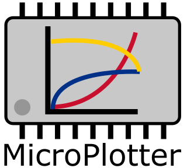
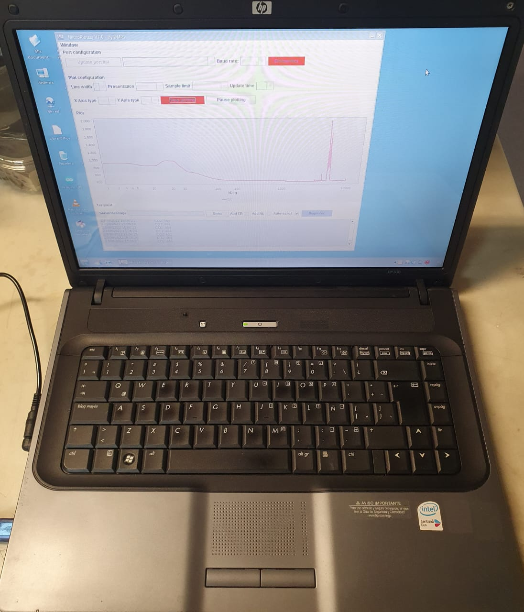
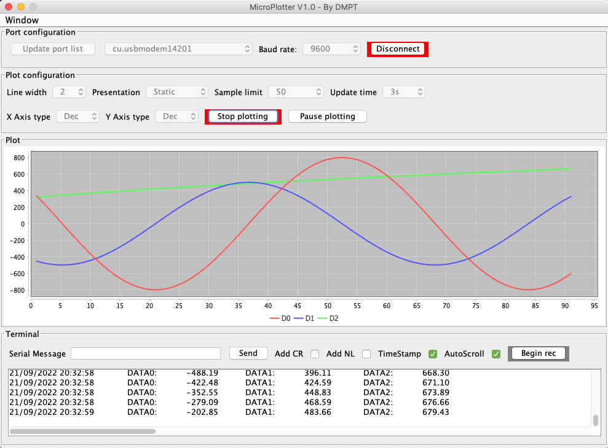

# MicroPlotter

    

You can download this application going to the releases section. Just download the file, unpack it and follow the installation guide provided in .pdf format.

Please continue reading.

MicroPlotter is a simple data plotting and recording tool written in java, hence, it works in all operating systems. It has been compiled under java 8 for major compatibility and older devices can also take advantage of this application (and it is <5Mb!). This software started several years ago as a fun personal exercise; then, a more primitive version was used for capturing data on a work published on 2017, where we needed to monitor and visualize incoming data from several MQ gas sensors that were capturing soil gas emisions, you can check the paper <a href="https://www.sciencedirect.com/science/article/abs/pii/S0168169916304070?via%3Dihub">here</a>. At that time we captured the data using a PIC16F886 microcontroller and the software proved to be very useful for our laboratory experiments and it is still useful today, so I decided to release this application after making several improvements to facilitate its use and to accomodate to different operating systems.

Give life to an old PC and re-purpose it as a data recording tool! For instance, look at the following image:

    

As you can see, you don't need the best computer to run this program. If you just need a tool to monitor and record data from say, a PIC microcontroler, an Arduino board, an ESP board or even a Raspberry Pi, you can use this software. Here you can see a screen capture of MicroPlotter working on a different operating system:

    

There are several options designed to facilitate your work when you need to visualize and record your data. It supports up to 9 columns for plotting, however, on the terminal you can have more columns. If you need too many plots, you can always run several instances of this program. Please, read the documentation that comes with the sofware.

This software was possible thanks to the popular libraries jSerialComm and jfreechart!