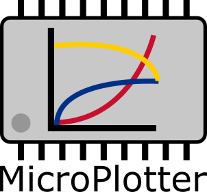

# MicroPlotterJava

MicroPlotter is a simple data plotting and recording tool written in java, hence, it works in all operating systems. It has been compiled under java 8 for major compatibility and older devices can also take advantage of this application. If you need a tool to monitor and record data from say, a PIC microcontroler, an Arduino board, an ESP board or even a Raspberry Pi, you can use this software.

